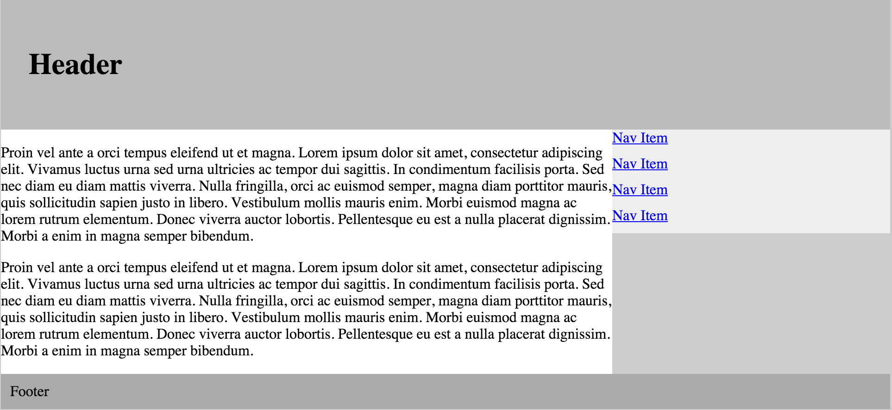

## Floats

1. Fork this repository.
1. Clone your fork.
1. Recreate this layout from the image below by editing style.css:

1. Commit your changes.
1. Push to github.
1. Create a pull request.

#### Resources:
* [CSS Tricks](http://www.smashingmagazine.com/2009/10/19/the-mystery-of-css-float-property/)
* [Learn Layout]
(http://learnlayout.com/)
* [A list apart](http://alistapart.com/article/css-floats-101/)
